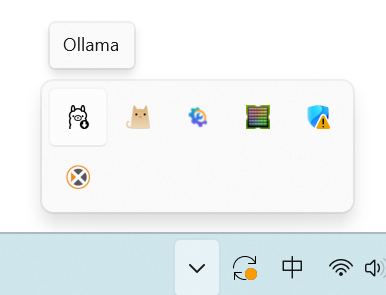
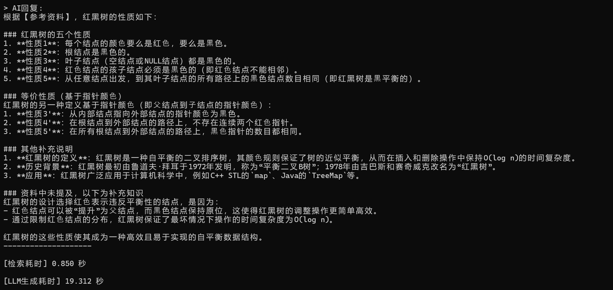

# 以DeepSeek-R1驱动的RAG知识库

本项目基于DeepSeek-R1模型与RAG(Retrieval-Augmented Generation)技术，能够直接通过本地 PDF 文件构建专属知识库，实现精准的文档检索与问答。

项目地址：https://github.com/Memento1475/HelloWorld


## 项目介绍

为解决文档内容太大难以检索、本地文档不便上传云端的问题，通过将本地PDF文档向量化储存，再借助DeepSeek强大的推理功能，让你随意浏览文档的任何部分。

------


### 项目特点

- **深度推理**：采用DeepSeek-R1模型，支持复杂的逻辑分析。
- **自动扫描**：程序将自动识别同目录下的PDF，用户无需手动配置路径。
- **保护隐私**：程序本地运行，无需上传到任何服务器。
- **智能文件识别**：程序启动后会自动扫描同级目录。若检测到多个PDF文件，会弹出列表供用户输入序号选择，无需手动修改文件名。


## 开发思路与过程

大预言模型在回答问题时，常常会出现“幻觉”。如果为其外挂一个专有知识库，让大模型在回答问题之前先检索一遍知识库，回答内容就会被知识库紧紧约束，减少出错的可能。


### 核心架构

```text
PDF文件 -> 文档加载、切块 -> 向量化 -> 存入向量数据库 -> 用户提问 -> 向量检索 -> 根据prompt, 本地大语言模型(Ollama)组织回答 -> 输出给用户
```

以层级结构表示：

1. **输入层**：使用glob像文件搜索。

2. **预处理层**：使用PyPDFLoader读PDF文件，TextSplitter把长文章切成小块（300字左右）。

3. **向量化层**：使用HuggingFaceEmbeddings调用Hugging Face的模型把中文句子变成向量。

4. **存储层**：使用Chroma存储向量，一个小数据库。

5. **检索层**：使用Chroma自带的搜索功能，计算向量相似度。

6. **增强层**：增加提示词。

7. **生成层**：使用Ollama运行本地大模型。

8. **输出层**：打印回答。


### 开发过程遇到的问题

#### 1. 环境与网络通信发生冲突（错误代码：502）

- **现象**：在Python代码尝试调用本地Ollama服务时，频繁报错 `ollama._types.ResponseError: (status code: 502)`。

- **原因分析**：开发环境开启了VPN代理软件。Python的 requests库默认通过系统代理发送请求，导致发往本地Ollama端口localhost:11434的流量被错误地转发到了VPN服务器，从而连接失败。

- **解决方案**：

  在系统环境变量中配置 `NO_PROXY=localhost,127.0.0.1`，强制本地流量直连，成功打通Python与Ollama的通信回路。

#### 2. 模型上下文限制导致溢出

- **现象**：在建立数据库时报错 `status code: 400 - the input length exceeds the context length`。
- **原因分析**：最初使用的嵌入模型 `all-minilm` 上下文窗口较小，约 256-512 token，而文本切分参数加上元数据后超过了模型处理能力的上限。
- **解决方案**：
  1. 更换了性能更强、上下文窗口更大、对中文支持效果更好的 `BAAI/bge-large-zh-v1.5` 模型。
  2. 调整 `RecursiveCharacterTextSplitter` 的切分策略，确保切片既不溢出又能保留完整语义。

#### 3. 语义检索存在偏差

- **现象**：在提问PDF中明确存在的概念时，系统却回答“参考资料未提及”。

- **原因分析**：

  默认检索数量太少，相关片段未进入前三。

- **解决方案**：

  将检索片段数提升，增加信息召回率。


## 使用方式

### 本地部署

1. 前往[Ollama官网](https://ollama.com/)下载并安装。

2. 在命令行输入：

```bash
ollama pull deepseek-r1
```

3. 从本项目[Releases页面](https://github.com/Memento1475/HelloWorld/releases)下载最新应用程序。

------

### 操作方法

1. 运行Ollama。
2. 将`.pdf`资料放入程序所在文件夹。

3. 双击`RAG知识库.exe`。

4. 待数据库构建完成后，在黑色控制台中输入你的问题。

5. 若想更换PDF资料或想重新建立索引时，请一定要删除**chroma_db_storage文件夹**，否则程序将继续使用旧的知识库内容。


## 使用演示

> [!NOTE]
>
> 首先要确保Ollama处于运行状态。
>
> 


`.pdf`与`.exe`在同一目录下。


运行界面：


输入问题，程序给出回答：


AI输出：

